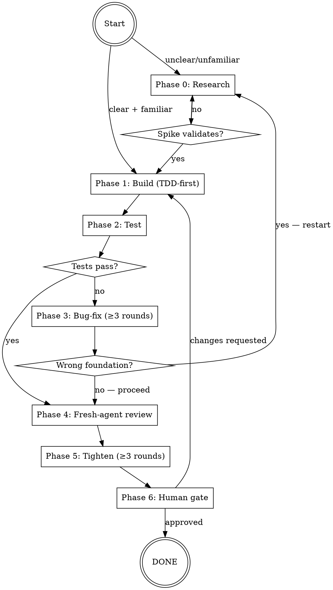

# Dev-Workflow Skill Implementation Plan

> **For agentic workers:** REQUIRED SUB-SKILL: Use superpowers:subagent-driven-development (recommended) or superpowers:executing-plans to implement this plan task-by-task. Steps use checkbox (`- [ ]`) syntax for tracking.

**Goal:** Write the `dev-workflow` skill file at `hq/skills/dev-workflow/SKILL.md`, add a LESSON that wires it into Boss's decision loop, and update STATE.md to reflect Subsystem B complete.

**Architecture:** Three independent write tasks (SKILL.md, lessons.md append, STATE.md update). No code — all markdown. Tasks 1–2 can be done in parallel; Task 3 depends only on Task 1 being correct.

**Tech Stack:** Markdown. No build system. No tests (markdown documents are verified by human read-through). Paths are all within `~/ventures/vibeboss-workspace/hq/`.

---

### Task 1: Write `hq/skills/dev-workflow/SKILL.md`

**Files:**
- Create: `~/ventures/vibeboss-workspace/hq/skills/dev-workflow/SKILL.md`

- [ ] **Step 1: Create the directory**

```bash
mkdir -p ~/ventures/vibeboss-workspace/hq/skills/dev-workflow
```

Expected: directory exists, no error.

- [ ] **Step 2: Write SKILL.md**

Write the following content exactly to `~/ventures/vibeboss-workspace/hq/skills/dev-workflow/SKILL.md`:

```markdown
---
name: dev-workflow
description: Use before any non-trivial implementation — the research → build → test → fix → review → tighten → partner-gate loop.
---

# Dev-Workflow

The standard development loop for Boss and any Build agent operating in the Vibeboss workspace. Invoke before any non-trivial implementation task.

## When to invoke

**Invoke dev-workflow before:**
- Adding a new feature (any non-trivial code addition)
- Fixing a non-trivial bug (anything beyond a 1-line mechanical fix)
- Refactoring code that spans more than one file
- Any change that alters observable behavior

**Skip for:** typo fixes, comment-only edits, single-variable renames, documentation updates with no behavior change.

**Hard gate:** If the trigger condition is met, invocation is non-optional — even for tasks that feel "obviously simple." The bug-fix and tightening rounds are exactly where simple tasks reveal hidden complexity.

## Phase table

| # | Phase | Entry condition | Hard gate | Output |
|---|---|---|---|---|
| 0 | **Research** | Requirement unclear OR API/codebase area unfamiliar | Spike must be validated before any of it is adopted | Notes confirming: what it does, how to call it, what breaks if misused |
| 1 | **Build** | Requirement clear + research done | Write at least one failing test before implementation | Working code + ≥1 passing test |
| 2 | **Test** | Build complete | All tests pass; golden path confirmed | Test results (count + status) |
| 3 | **Bug-fix** | Any test failure or visible defect | **≥ 3 rounds minimum** | All tests passing; no known defects |
| 4 | **Fresh-agent review** | Bug-fix done | Agent must have zero inherited context; receives spec + diff | Review findings list |
| 5 | **Tighten** | Fresh-agent findings applied | **≥ 3 rounds minimum** | Refined, hardened code |
| 6 | **Human gate** | Tightening done | Partner must approve; do not self-declare done | Partner approval |

## Loop diagram



## Per-phase guide

### Phase 0 — Research

Enter when you cannot answer both: "Can I state the implementation in one sentence?" and "Do I know the exact API / codebase pattern I'm using?"

1. Read relevant docs or code (Context7 for library docs, `grep`/`Read` for codebase).
2. Write a throw-away spike — minimal, isolated, demonstrates the pattern works.
3. Run the spike. Verify output is what you expected.
4. Do not copy spike code directly into the codebase — adopt the *pattern*, not the draft.

Skill integration: if the requirement itself is unclear (not just the implementation), invoke `superpowers:brainstorming` first.

Exit: you can name the function signature, describe the call flow in one sentence, spike passes.

---

### Phase 1 — Build

Enter when requirement and implementation are clear and any needed research is done.

1. Invoke `superpowers:test-driven-development` if available.
2. Write a failing test that captures the desired behavior.
3. Write minimum implementation to pass it.
4. Expand tests for edge cases as you build.
5. Commit working intermediate states.

Exit: all tests pass, no TODO/FIXME left unaddressed.

---

### Phase 2 — Test

Enter when build is complete.

1. Run the full test suite.
2. If a golden path can be exercised manually (server running, CLI command available), do it.
3. Ensure no test is skipped or commented out.

Loop-back rule:
- Failures are **bugs** (logic errors, edge cases) → Phase 3.
- Failures reveal a **wrong foundation** (built the wrong thing) → Phase 0. Do not attempt 3 bug-fix rounds on the wrong foundation.

Exit: all tests pass + golden path confirmed.

---

### Phase 3 — Bug-fix (≥ 3 rounds)

Enter when there are test failures or known defects.

- **Round 1:** Fix the failing tests. One issue at a time. Re-run after each fix.
- **Round 2:** Run full suite again. Round-1 fixes often surface secondary failures. Fix those.
- **Round 3:** Final run. If still failing, invoke `superpowers:systematic-debugging`. Do not take a 4th blind stab.

Hard gate: even if all tests pass after Round 1, run Rounds 2 and 3 anyway. Round 2 checks regressions; Round 3 is clean final confirmation.

Exit: 3 rounds completed, all tests passing.

---

### Phase 4 — Fresh-agent review

Enter when bug-fix done.

Dispatch a fresh agent with zero inherited session context. Pass:
- Task spec (one paragraph: what this change does)
- Success criteria (what "done" looks like)
- Full code diff or relevant file contents

**Prompt template:**

```
You are reviewing this implementation. No prior context. Be direct.

Task spec: [one-paragraph description of what this change does]

Success criteria:
- [criterion 1]
- [criterion 2]

Files changed / code to review:
[paste diff or full file contents]

Tell me: (1) anything that's broken, (2) anything missing from the spec,
(3) anything that could be cleaner or safer. Number your findings.
If nothing's wrong, say so explicitly.
```

For each finding: fix it, or consciously defer it with a note. Don't silently discard anything.

Exit: all findings addressed (fixed or explicitly deferred with rationale).

---

### Phase 5 — Tighten (≥ 3 rounds)

Enter when fresh-agent findings applied.

- **Round 1 — Code clarity:** rename non-obvious identifiers, remove dead code, extract magic literals.
- **Round 2 — Test quality:** add missing edge cases, make assertions specific, fix fragile tests.
- **Round 3 — Hardening:** invalid input paths, external call failures, readable error messages, brief inline comments where non-obvious.

Hard gate: complete all 3 rounds even if Round 1 already feels clean.

Exit: 3 rounds complete, no remaining known fragility.

---

### Phase 6 — Human gate

Enter when tightening complete.

Present to partner in this exact format:

```
READY FOR REVIEW
─────────────────────────────
What was built:   [one sentence]
Tests:            [N passing, 0 failing]
Fresh-agent:      [N findings — X applied, Y deferred (list deferred)]
Tightening:       Round 1: [what changed]; Round 2: [what changed]; Round 3: [what changed]
─────────────────────────────
Waiting for your approval.
```

Hard gate: do not self-declare done. Wait for explicit partner approval.

---

## Skill integration map

| When | Invoke |
|---|---|
| Phase 0, requirement unclear | `superpowers:brainstorming` |
| Phase 1, building feature code | `superpowers:test-driven-development` |
| Phase 3, stuck after 3 rounds | `superpowers:systematic-debugging` |
| Phase 4, dispatching fresh reviewer | `Agent` tool directly |
| Phase 6, formal PR-style review | `superpowers:requesting-code-review` |
```

- [ ] **Step 3: Verify file exists and is non-empty**

```bash
wc -l ~/ventures/vibeboss-workspace/hq/skills/dev-workflow/SKILL.md
```

Expected: line count > 100 (the file is substantial).

- [ ] **Step 4: Spot-check required sections**

```bash
grep -n "Phase table\|Loop diagram\|Per-phase\|Fresh-agent\|Human gate\|Skill integration" \
  ~/ventures/vibeboss-workspace/hq/skills/dev-workflow/SKILL.md
```

Expected: all 6 section headers present with non-zero line numbers.

---

### Task 2: Append LESSON-005 to `hq/lessons.md`

**Files:**
- Modify: `~/ventures/vibeboss-workspace/hq/lessons.md`

- [ ] **Step 1: Read the current end of lessons.md to confirm the last lesson number**

```bash
grep "^## LESSON-" ~/ventures/vibeboss-workspace/hq/lessons.md
```

Expected output: lines listing LESSON-001 through LESSON-004. Confirm the next is LESSON-005.

- [ ] **Step 2: Append LESSON-005**

Open `~/ventures/vibeboss-workspace/hq/lessons.md` and append the following block at the end of the file (after LESSON-003's closing paragraph):

```markdown

## LESSON-005 — Invoke dev-workflow before any non-trivial implementation
**Rule:** Before writing code for any feature, non-trivial bug fix, or multi-file refactor, invoke the `dev-workflow` skill at `hq/skills/dev-workflow/SKILL.md`. This is not optional even for tasks that feel simple. "Simple" tasks are where the bug-fix and tightening rounds reveal hidden complexity.
**Why:** Partner and Boss both agreed that the research → build → test → fix → review → tighten → human-gate loop needs to be a hard-gate discipline, not an informal checklist. Without an explicit skill reference, the loop gets compressed under time pressure. Logged 2026-05-26 as Subsystem B of the Vibeboss framework build.
**Where it applies:** Every session where code is being written or changed. Skip only for: typo fixes, comment-only edits, single-variable renames, docs updates with no behavior change. When in doubt, invoke it.
```

- [ ] **Step 3: Verify LESSON-005 was appended**

```bash
grep -A 5 "LESSON-005" ~/ventures/vibeboss-workspace/hq/lessons.md
```

Expected: LESSON-005 header and first line of the rule visible.

---

### Task 3: Update `STATE.md`

**Files:**
- Modify: `~/ventures/vibeboss-workspace/hq/STATE.md`

- [ ] **Step 1: Read the current Next and Recently closed sections**

Read `~/ventures/vibeboss-workspace/hq/STATE.md` lines around the "Recently closed" and "Next" sections to find exact text to replace.

- [ ] **Step 2: Move Subsystem B entry from Next to Recently closed**

In `~/ventures/vibeboss-workspace/hq/STATE.md`:

**Find this line in the `## Recently closed` section** (after the 2026-05-26 topology entry):
```
- **2026-05-26** — Topology + HQ split shipped. Runtime moved out of vibeboss/ into vibeboss-workspace/{hq,labs,projects/}. Subsystem A of the 7-subsystem Vibeboss-framework arc complete. See runlog/2026-05-26-topology-migration.md.
```

**Add this line immediately after it:**
```
- **2026-05-26** — Dev-workflow skill shipped (Subsystem B). `hq/skills/dev-workflow/SKILL.md` written: 7-phase loop (research → build → test → ≥3-round bug-fix → fresh-agent review → ≥3-round tighten → human gate). LESSON-005 added to lessons.md. See runlog/2026-05-26-subsystem-B-dev-workflow.md.
```

- [ ] **Step 3: Update the Next section — remove Subsystem B item**

In the `## Next` section, find and **remove** item 1:
```
1. **Subsystem B — Dev-workflow skill** (next in A→G sequence). Write the `research → experiment → validate → adopt → build → test → 3-round bug-fix → fresh-agent review → 3 tightening → human gate` loop as a skill in `hq/skills/dev-workflow/SKILL.md`. Brainstorm → spec → plan → execute per the standard workflow.
```

Then renumber all remaining items (old item 2 becomes new item 1, etc.).

- [ ] **Step 4: Update the Last updated date**

Find the line:
```
**Last updated:** 2026-05-25 (after WhatsApp PA dashboard ship / `/goal` complete)
```

Replace with:
```
**Last updated:** 2026-05-26 (after Subsystem B — dev-workflow skill shipped)
```

- [ ] **Step 5: Verify STATE.md changes**

```bash
grep -n "Subsystem B\|LESSON-005\|dev-workflow\|Last updated" \
  ~/ventures/vibeboss-workspace/hq/STATE.md
```

Expected: "Subsystem B" appears only in Recently closed (not in Next). "dev-workflow" appears in Recently closed. "Last updated" shows 2026-05-26.

---

## Self-review checklist (run after all tasks)

- [ ] `hq/skills/dev-workflow/SKILL.md` exists with all 7 sections
- [ ] SKILL.md frontmatter has `name: dev-workflow` and a one-line description
- [ ] Phase table has 7 rows (phases 0–6)
- [ ] Loop diagram is syntactically valid dot code (inspect visually)
- [ ] Fresh-agent prompt template is verbatim copy-pasteable (no `[undefined]` placeholders)
- [ ] Human gate presentation format is present with exact dash-line dividers
- [ ] LESSON-005 appended and references the skill path
- [ ] STATE.md: "Last updated" = 2026-05-26
- [ ] STATE.md: Subsystem B in Recently closed, not in Next
- [ ] No TBDs, TODOs, or vague placeholders anywhere in any of the three files
