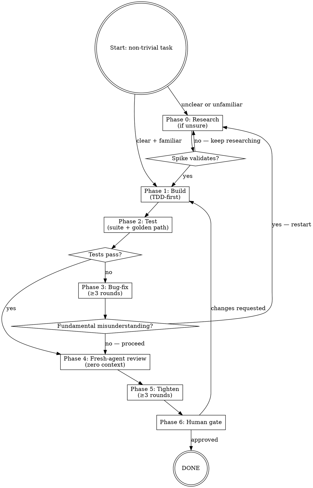

# Subsystem B — Dev-Workflow Skill Design

**Status:** approved — proceeding to implementation plan
**Date:** 2026-05-26
**Author:** Boss (Vibeboss venture lead)
**Approver:** partner (via task brief)
**Predecessors:** [2026-05-26-topology-hq-split-design.md](2026-05-26-topology-hq-split-design.md) — Subsystem A established the `hq/skills/` directory where this skill lives.

---

## Goal

Capture the standard Vibeboss development loop as a single reusable skill that Boss (and future Bosses) auto-invoke before any non-trivial implementation. The loop as specified:

> research-if-unsure → experiment → validate → adopt → continue building → test → at least 3 rounds bug-fix → spawn fresh agent and see what else to do → repeat → ~3 rounds tightening → human gate

The skill must be:
- Self-contained enough that a fresh Boss (new session, zero context) can follow it without reading anything else
- Explicit about hard-gate counts (≥3 bug-fix rounds, ≥3 tightening rounds) so these are not soft suggestions
- Expressive about the loop-back condition (when to go back to research vs. continue forward)
- Integrated with the existing superpowers skill ecosystem (brainstorming, TDD, systematic-debugging, requesting-code-review)

---

## Approaches considered

### Approach A — Flat numbered checklist

A simple ordered list, like a pre-flight checklist. Each item is a check-box. Easy to scan and follow mechanically.

**Pro:** Minimal cognitive load, nothing to interpret.
**Con:** Loops are invisible. "3 rounds of bug-fix" becomes items 7a/7b/7c, and the "repeat → loop back" condition can't be expressed naturally. A future Boss might miss that Phase 4 (fresh agent) feeds back into Phase 1 under certain conditions.

### Approach B — Full state machine with dot/mermaid diagram

Every phase is a node, every transition is a labelled edge. The loop-back conditions, the "≥3 rounds" counters, and the "human gate = terminal state" are all expressed in the graph.

**Pro:** Complete and unambiguous; impossible to skip a loop.
**Con:** Heavy. The subagent-driven-development skill already uses this pattern for a complex orchestration workflow. Using it here for a simpler iterative loop would over-engineer and add reading overhead every time the skill is invoked.

### Approach C — Phase table + compact loop diagram (RECOMMENDED)

A dot flow diagram at the top for at-a-glance orientation, followed by a table of phases with Entry / Hard-gate / Output columns, followed by per-phase prose for the non-obvious rules. The table is the contract; the diagram is orientation; the prose handles nuance.

**Why this wins:**
- The loop structure is visible in the diagram without reading the table
- The table is scannable during execution (one row = one phase)
- The hard-gate counts appear in bold in the table so they can't be missed
- The prose sections are only consulted when a phase is actively running
- Works well for a skill that will be read repeatedly, not just once

---

## Design

### Trigger condition

Invoke `dev-workflow` before:
- Adding a new feature (any non-trivial code addition)
- Fixing a non-trivial bug (anything that requires more than a 1-line mechanical fix)
- Refactoring code that spans more than one file
- Any change that alters observable behavior

Skip for: typo fixes, comment-only edits, single-variable renames, documentation updates with no behavior change.

**Hard gate:** If the trigger condition is met, invocation is non-optional. This applies even for tasks that feel "obviously simple" — the bug-fix and tightening rounds are exactly where simple tasks reveal hidden complexity.

---

### The seven phases

| # | Phase | Entry condition | Hard gate | Output |
|---|---|---|---|---|
| 0 | **Research** | Requirement is unclear OR codebase area / API is unfamiliar | Spike code must be validated before any of it is adopted into the real build | Notes confirming: what it does, how to call it, what breaks if misused |
| 1 | **Build** | Requirement is clear + any needed research is done | Must write at least one failing test before writing implementation (TDD minimum) | Working code + at least one passing test |
| 2 | **Test** | Build complete | All tests pass; golden path verified manually or via script | Test results (count + status) |
| 3 | **Bug-fix** | Any test failure OR visible defect | **≥ 3 rounds minimum.** Round 1: fix failures. Round 2: run again, fix secondary issues. Round 3: final run. Do not declare done after round 1 even if tests pass. | All tests passing; no known defects |
| 4 | **Fresh-agent review** | Bug-fix rounds complete | Agent must have zero inherited session context. Must receive: task spec + success criteria + full code diff. | Review findings (list of issues, suggestions, concerns) |
| 5 | **Tighten** | Fresh-agent findings applied | **≥ 3 rounds minimum.** Round 1: code clarity. Round 2: test coverage. Round 3: hardening (error paths, edge cases). | Refined, hardened code |
| 6 | **Human gate** | Tightening complete | Partner must approve. Do not self-declare done. | Partner approval + "done" status |

---

### Loop diagram



---

### Phase 0 — Research

**When to enter:** Before building, ask: "Can I state the implementation in one sentence?" and "Do I know the exact API / codebase pattern I'm using?" If either is no, enter this phase.

**What to do:**
1. Read the relevant docs or code (Context7 for library docs, `grep`/`Read` for codebase).
2. Write a throw-away spike — a minimal, isolated script or function that demonstrates the pattern works.
3. Run the spike. Verify it behaves as expected.
4. **Do not copy spike code directly into the codebase** — adopt the pattern, not the draft.

**Skill integration:** if the requirement itself is unclear (not just the implementation), invoke `superpowers:brainstorming` first.

**Exit gate:** you can name the function signature, describe the call flow in a sentence, and the spike passes.

---

### Phase 1 — Build

**When to enter:** Requirement and implementation are clear. Research (if needed) is done.

**What to do:**
1. Invoke `superpowers:test-driven-development` if available.
2. Write a failing test that captures the desired behavior.
3. Write minimum implementation to pass it.
4. Expand tests for edge cases as you build.
5. Commit working intermediate states (don't wait until the whole feature is done).

**Exit gate:** all tests pass, code compiles/runs, no TODO/FIXME left unaddressed.

---

### Phase 2 — Test

**When to enter:** Build is complete.

**What to do:**
1. Run the full test suite.
2. If a golden path can be exercised manually (server is running, UI is accessible, CLI command works), do it.
3. Check that no test is skipped or commented out.

**Loop-back rule:**
- If failures are bugs (logic errors, edge cases): proceed to Phase 3.
- If failures reveal a **fundamental misunderstanding of requirements** (you built the wrong thing): loop back to Phase 0 (Research). Do not attempt 3 rounds of bug-fixing on the wrong foundation.

**Exit gate:** all tests pass + golden path confirmed.

---

### Phase 3 — Bug-fix (≥ 3 rounds)

**When to enter:** test failures or known defects.

**The discipline:**
- **Round 1:** fix the failing tests. One issue at a time. Re-run after each fix.
- **Round 2:** run the full suite again. Fixes often surface secondary failures. Fix those.
- **Round 3:** final run. If still failing, don't loop forever — escalate (see below).

**Escalation rule:** if after 3 rounds a test still fails and the fix isn't obvious, invoke `superpowers:systematic-debugging`. Do not take a 4th blind stab.

**Hard gate:** even if all tests pass after Round 1, still run Rounds 2 and 3. Round 2 tests for regressions introduced by the round-1 fix; Round 3 is a clean final confirmation.

**Exit gate:** 3 rounds minimum completed, all tests passing.

---

### Phase 4 — Fresh-agent review

**When to enter:** bug-fix done.

**Why fresh agent:** the current session has accumulated context that creates blind spots. A fresh agent with only the code diff and spec will see issues the current session has normalized away.

**How to dispatch:**
1. Use the `Agent` tool (or subagent dispatch).
2. Pass **zero inherited context** — do not relay recent conversation history.
3. Include in the prompt:
   - The task spec (one paragraph: what this change is supposed to do)
   - The success criteria (what "done" looks like)
   - The full code diff or relevant file contents
4. Ask: "What's broken, what's missing, what could be better? Be direct."

**Prompt template (copy-paste into Agent):**
```
You are reviewing this implementation. No prior context. Be direct.

Task spec: [one-paragraph description of what this change does]

Success criteria:
- [criterion 1]
- [criterion 2]

Files changed / code to review:
[paste diff or full file contents]

Tell me: (1) anything that's broken, (2) anything missing from the spec, (3) anything that could be cleaner or safer. Number your findings. If nothing's wrong, say so explicitly.
```

**Apply findings:** for each finding — fix it, or consciously defer it with a note. Don't silently discard anything.

**Exit gate:** all findings addressed (fixed or explicitly deferred with rationale).

---

### Phase 5 — Tighten (≥ 3 rounds)

**When to enter:** fresh-agent findings applied.

**Round 1 — Code clarity:**
- Rename anything that isn't immediately obvious
- Remove dead code, commented-out blocks, debug prints
- Extract any magic literals into named constants
- Ensure no function is doing two unrelated things

**Round 2 — Test quality:**
- Are there edge cases not covered by any test?
- Are assertions specific enough? (`expect(x).toBe(3)` not `expect(x).toBeTruthy()`)
- Would a future refactor silently break a test without catching a real bug? If yes, rewrite the test.
- Add missing tests.

**Round 3 — Hardening:**
- What happens on invalid input?
- What happens if an external call fails?
- Are error messages human-readable?
- Are any non-obvious behaviors documented (brief inline comment is fine; no multi-line docstring blocks)?

**Hard gate:** complete all 3 rounds even if Round 1 already feels clean.

**Exit gate:** 3 rounds complete, no remaining known fragility.

---

### Phase 6 — Human gate

**When to enter:** tightening complete.

**Presentation format (required):**

```
READY FOR REVIEW
─────────────────────────────
What was built:   [one sentence]
Tests:            [N passing, 0 failing]
Fresh-agent:      [N findings — X applied, Y deferred (list deferred items)]
Tightening:       [brief list of what changed in each of the 3 rounds]
─────────────────────────────
Waiting for your approval.
```

**Exit gate:** partner explicitly approves. Do not self-declare done.

---

### Skill integration map

| When | Invoke |
|---|---|
| Phase 0, requirement is unclear | `superpowers:brainstorming` |
| Phase 1, building feature code | `superpowers:test-driven-development` |
| Phase 3, stuck after 3 rounds | `superpowers:systematic-debugging` |
| Phase 4, dispatching fresh reviewer | `Agent` tool directly (no skill wrapper) |
| Phase 6, formal PR-style review | `superpowers:requesting-code-review` |

---

## SKILL.md output shape

The skill artifact produced by this design lives at `hq/skills/dev-workflow/SKILL.md`. It follows the standard YAML frontmatter + markdown body format used by the superpowers plugin pack:

```yaml
---
name: dev-workflow
description: Use before any non-trivial implementation — the research → build → test → fix → review → tighten → partner-gate loop.
---
```

Body sections:
1. When to invoke (trigger condition)
2. Phase table (the contract)
3. Loop diagram (orientation)
4. Per-phase details (execution guide)
5. Fresh-agent prompt template
6. Human gate presentation format
7. Skill integration map

The SKILL.md should be **completely self-contained** — a freshly booted Boss should be able to follow it without reading this design doc.

---

## What this design does NOT cover

- **C: Crew system** — per-project named agents, crew.yml registry
- **D: Auto-boot on new conversation** — SessionStart hook
- **E: Compact handover protocol** — pre-compact ritual + post-compact reboot
- **F: Research labs** — labs/ init flow, signal contracts
- **G: `vibeboss init` flow** — productized init command

---

## Definition of done

This subsystem is "shipped" when:

1. `hq/skills/dev-workflow/SKILL.md` exists and is complete.
2. The SKILL.md is self-contained: a new Boss can follow it without reading this design doc.
3. The phase table, loop diagram, hard gates, fresh-agent template, and human gate format are all present.
4. The `hq/CLAUDE.md` (or `lessons.md`) references the skill so future Bosses know to look for it.
5. `STATE.md` updated: Subsystem B moved to Recently closed, Subsystem C promoted.
6. Runlog entry written.
