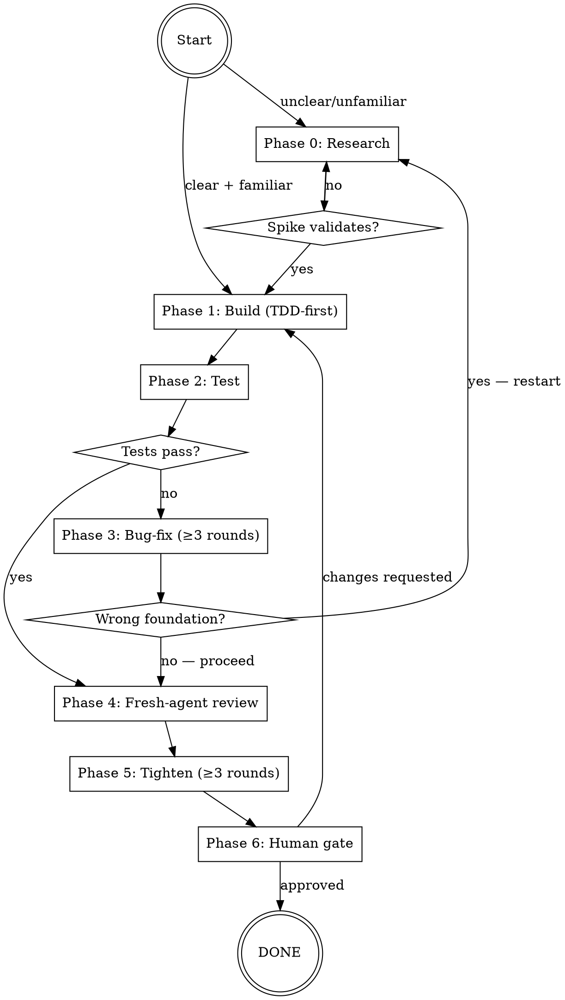

# Dev-Workflow

The standard development loop for Boss and any Build agent operating in the Vibeboss workspace. Invoke before any non-trivial implementation task.

## When to invoke

**Invoke dev-workflow before:**
- Adding a new feature (any non-trivial code addition)
- Fixing a non-trivial bug (anything beyond a 1-line mechanical fix)
- Refactoring code that spans more than one file
- Any change that alters observable behavior

**Skip for:** typo fixes, comment-only edits, single-variable renames, documentation updates with no behavior change.

**Hard gate:** If the trigger condition is met, invocation is non-optional — even for tasks that feel "obviously simple." The bug-fix and tightening rounds are exactly where simple tasks reveal hidden complexity.

## Phase table

| # | Phase | Entry condition | Hard gate | Output |
|---|---|---|---|---|
| 0 | **Research** | Requirement unclear OR API/codebase area unfamiliar | Spike must be validated before any of it is adopted | Notes confirming: what it does, how to call it, what breaks if misused |
| 1 | **Build** | Requirement clear + research done | Write at least one failing test before implementation | Working code + ≥1 passing test |
| 2 | **Test** | Build complete | All tests pass; golden path confirmed | Test results (count + status) |
| 3 | **Bug-fix** | Any test failure or visible defect | **≥ 3 rounds (default; carve-out for <50 LOC)** | All tests passing; no known defects |
| 4 | **Fresh-agent review** | Bug-fix done | Agent must have zero inherited context; receives spec + diff | Review findings list |
| 5 | **Tighten** | Fresh-agent findings applied | **≥ 3 rounds (default; carve-out for <50 LOC)** | Refined, hardened code |
| 6 | **Human gate** | Tightening done | Partner must approve; do not self-declare done | Partner approval |

## Loop diagram



## Per-phase guide

### Phase 0 — Research

Enter when you cannot answer both: "Can I state the implementation in one sentence?" and "Do I know the exact API / codebase pattern I'm using?"

1. Read relevant docs or code (Context7 for library docs, `grep`/`Read` for codebase).
2. Write a throw-away spike — minimal, isolated, demonstrates the pattern works.
3. Run the spike. Verify output is what you expected.
4. Do not copy spike code directly into the codebase — adopt the *pattern*, not the draft.

Skill integration: if the requirement itself is unclear (not just the implementation), invoke `superpowers:brainstorming` first — this is mandatory, not optional. Do not begin a spike until the requirement is crisp.

Exit: you can name the function signature, describe the call flow in one sentence, spike passes.

---

### Phase 1 — Build

Enter when requirement and implementation are clear and any needed research is done.

1. Invoke `superpowers:test-driven-development` if available; if not, write the failing test manually before any implementation code.
2. Write a failing test that captures the desired behavior.
3. Write minimum implementation to pass it.
4. Expand tests for edge cases as you build.
5. Commit working intermediate states.

Exit: all tests pass, no TODO/FIXME left unaddressed. An intentional deferral is allowed only if it is converted to a tracked follow-up (write it as a note in the runlog or a follow-up file) — never leave a bare TODO comment in committed code.

---

### Phase 2 — Test

Enter when build is complete.

1. Run the full test suite.
2. If a golden path can be exercised manually (server running, CLI command available), do it.
3. Ensure no test is skipped or commented out.

Loop-back rule:
- Failures are **bugs** (logic errors, edge cases) → Phase 3.
- Failures reveal a **wrong foundation** (built the wrong thing) → Phase 0. Do not attempt 3 bug-fix rounds on the wrong foundation.

Decision heuristic: if the spec says X and your code does Y (wrong implementation), that is a bug → Phase 3. If the test failures reveal that you misunderstood what the spec means (you built what you thought was specified, but the spec itself was misread), that is a wrong foundation → Phase 0.

Exit: all tests pass + golden path confirmed.

---

### Phase 3 — Bug-fix (≥ 3 rounds)

Enter when there are test failures or known defects. (Note: Phase 3 rounds all target the same failing tests — fix → re-run → fix → re-run. This is different from Phase 5, where each round targets a different aspect of the code.)

- **Round 1:** Fix the failing tests. One issue at a time. Re-run after each fix.
- **Round 2:** Run full suite again. Round-1 fixes often surface secondary failures. Fix those.
- **Round 3:** Final run. If still failing, invoke `superpowers:systematic-debugging` to diagnose the root cause. After systematic-debugging identifies the issue, loop back to Round 1 with the new understanding. If the root cause reveals a fundamental misunderstanding of requirements, exit to Phase 0 (Research) instead. (Same decision point as the Phase 2 loop-back heuristic above.)

**Default: 3 rounds.** Skip subsequent rounds only when all of: (a) the change touches <50 LOC, (b) the most recent round revealed no failures and no regressions, (c) you record the skip in the runlog with a one-line rationale. The default reflects that round 2 catches Round-1 regressions and round 3 confirms cleanly — most non-trivial changes benefit from all three; the carve-out keeps small fixes from becoming ceremony (per LESSON-002).

Exit: 3 rounds completed, all tests passing.

---

### Phase 4 — Fresh-agent review

Enter when bug-fix done.

Dispatch a fresh agent with zero inherited session context using the `Agent` tool — this is the standard Claude Code subagent dispatch tool, available in all Boss sessions. Do not use the `Skill` tool and do not pass session history. Include all of the following in the prompt text you pass to the fresh agent:
- Task spec (one paragraph: what this change does)
- Success criteria (what "done" looks like)
- Full code diff or relevant file contents

**Prompt template:**

```
You are reviewing this implementation. No prior context. Be direct.

Task spec: [one-paragraph description of what this change does]

Success criteria:
- [criterion 1]
- [criterion 2]

Files changed / code to review:
[paste diff or full file contents]

Tell me: (1) anything that's broken, (2) anything missing from the spec,
(3) anything that could be cleaner or safer. Number your findings.
If nothing's wrong, say so explicitly.
```

Capture findings in your session as you read them — a numbered list in your working notes is sufficient. For each finding: fix it immediately in the codebase, or consciously defer it with a note. Don't silently discard anything. You do not need a separate file for findings; the Phase 6 human-gate summary is where deferred items are documented.

Exit: all findings addressed (fixed or explicitly deferred with rationale).

---

### Phase 5 — Tighten (≥ 3 rounds)

Enter when fresh-agent findings applied. (Note: Phase 5 rounds each target a different aspect of the code — clarity, then test quality, then hardening. This is different from Phase 3, where all rounds target the same failing tests.)

Each round is **discrete** — apply only its category of changes, then re-run the full suite before moving to the next.

- **Round 1 — Code clarity only:** rename non-obvious identifiers, remove dead code, extract magic literals. No test or hardening changes in this round.
- **Round 2 — Test quality only:** add missing edge cases, make assertions specific, fix fragile tests. No clarity or hardening changes in this round.
- **Round 3 — Hardening only:** invalid input paths, external call failures, readable error messages, brief inline comments where non-obvious. No clarity or test changes in this round.

**Default: 3 discrete rounds** (clarity, test quality, hardening). Re-run the full suite after each round; if a round's changes break previously-passing tests, fix those regressions within the current round before advancing. **Skip subsequent rounds only when all of: (a) the change touches <50 LOC, (b) the preceding round revealed nothing to tighten in the next category, (c) you record the skip in the runlog with a one-line rationale.** The default is right for most changes; the carve-out keeps small fixes from becoming ceremony (per LESSON-002).

Exit: 3 rounds complete, no remaining known fragility.

---

### Phase 6 — Human gate

Enter when tightening complete.

Present to partner in this exact format:

```
READY FOR REVIEW
─────────────────────────────
What was built:   [one sentence]
Tests:            [N passing, 0 failing]
Fresh-agent:      [N findings — X applied, Y deferred: "finding text" (reason), ...]
Tightening:       Round 1: [what changed]; Round 2: [what changed]; Round 3: [what changed]
─────────────────────────────
Waiting for your approval.
```

Hard gate: do not self-declare done. Stop here and do not begin any new work until partner responds. Wait for explicit partner approval before proceeding.

---

## Skill integration map

| When | Invoke |
|---|---|
| Phase 0, requirement unclear | `superpowers:brainstorming` |
| Phase 1, building feature code | `superpowers:test-driven-development` |
| Phase 3, stuck after 3 rounds | `superpowers:systematic-debugging` |
| Phase 4, dispatching fresh reviewer | `Agent` tool directly (not a skill — raw isolation required; no skill context should bleed into the reviewer's context) |
| Phase 6, formal PR-style review | `superpowers:requesting-code-review` (collaborative — skill context is fine here; partner is also reviewing) |
